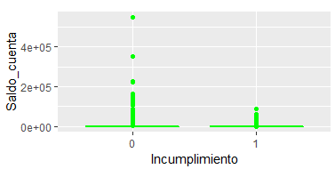
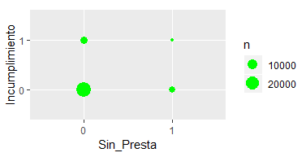
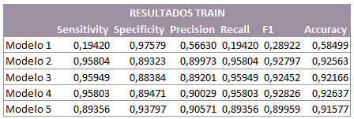
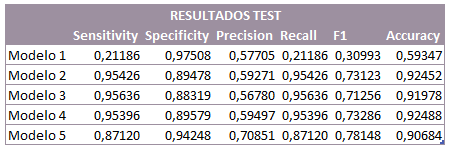

# Scoring Bancario

## ` `**Comprensión del negocio**
### Determinar los objetivos del negocio
#### ***Contexto***
El sector financiero en Colombia se caracteriza por tener más de $1.600 billones en activos y 415 entidades (El tiempo, 2017). Que son organizaciones o instituciones, tanto públicas como privadas, por medio de las cuales se captan, administran, regulan y dirigen los recursos financieros que se negocian entre los diversos agentes económicos llámense personas, empresas, Estado y/o sector público. Estos pueden ser entidades de crédito, sociedades de servicios financieros y otros establecimientos que agrupan diferentes líneas de negocio (ENS, 2015) como se aprecia a continuación.

Para el desarrollo de este proyecto el estudio se centrará en, el entendimiento de los establecimientos de crédito los cuales tienen como función la captación del público en moneda legal, a través de depósitos a la vista o a término, para su posterior colocación mediante préstamos, descuentos, anticipos u otras operaciones relativas al crédito (Asobancaria, 2017) centrándonos en el estudio de entidades bancarias. Los cuales son empresas financieras encargadas de captar recursos en forma de depósitos y prestar dinero, además de la prestación de una gama de servicios financieros por medio de sus diversas filiales.

Dentro de este contexto las entidades bancarias trabajan en base a portafolios de productos que  están conformados principalmente por cuentas de ahorros, cuentas corrientes, créditos y tarjetas de crédito; y según el reporte anual de Asobancaria, 14 para el cuarto trimestre del año 2014, en Colombia existían 27,1 millones de personas mayores de edad que contaban al menos con un producto financiero, correspondiente al 72,5% de la población adulta del país, este indicador para 2018 quedo en el 80,1. Así mismo el sector financiero colombiano, está monopolizado por unos pocos grupos financieros, que a través de sus conglomerados de empresas, ofrecen un amplio portafolio de servicios de toda índole, desde servicios bancarios, seguros, administración de valores, hasta administración de fondos de inversión, pensión y cesantías, entre otros. Diez de estas empresas se pueden se pueden apreciar y estas concentran el 67,9 de inversiones financieras del país, 60.9% del total de ingresos del sector y 65,73% del total de utilidades.

##### Scoring Bancario
El puntaje de crédito o score es una calificación que determina la probabilidad que una persona tiene de pagar sus obligaciones, la cual se basa en su experiencia crediticia, uso y saldo de sus créditos, además de otras variables sociodemográficas. En Colombia empresas como DataCredito, Expirian o TransUnion son entidades que ponen a disposición de los interesados canales de consulta de este. El puntaje de crédito tiene un rango de 150 a 950 puntos y entre más alta sea la calificación que usted obtenga, mayores serán las posibilidades de obtener un crédito puesto que para las entidades este representa un riesgo menor (El tiempo, 2017).

Sin embargo, este concepto ha evolucionado a ser un elemento de apoyo a las actividades del analista de crédito, que determinan factores de riesgo a someter a evaluación; y con base en la información recopilada realizar un análisis de aprobación o negación de una solicitud. De esta manera Scoring queda definido como la implementación de sistemas de evaluación de riesgo financiero cuyo funcionamiento se basa en técnicas de procesamiento de información propias de la inteligencia artificial o “big data” (Ospina, 2017).  Convirtiéndose en una herramienta que permite llevar los análisis de riesgo más allá de los reportes en centrales de riesgo hasta las mismas redes sociales.

En el caso de su uso en entidades bancarias el Scoring como lo señala *Oriol Amat* está muy generalizado para el crédito de consumo dirigido a particulares, tarjetas de crédito e hipotecas vivienda. Según datos de Fair Isaac Company, más del 75% de las entidades de crédito lo usan para la concesión de hipotecas y más del 90% lo usan para tarjetas de crédito. Los cuales en la actualidad son propios y también hay empresas que suministran informes sobre clientes basados en scorings, como Equifax, Experian, Transunion y Axesor. 

El Scoring suele hacerse a partir del denominado análisis discriminante, que se realiza en dos etapas: 

**Primera etapa (Análisis factorial discriminante):** El objetivo de esta etapa es identificar las variables que se utilizarán en el sistema de puntuación. Para ello, se necesita un conjunto de prestatarios que integran la muestra a utilizar y se definirán los comportamientos de los que se quieren formular predicciones (pago puntual de los créditos o impago de los créditos). Así como, es estado final de los clientes cumplimiento o incumplimiento (Amat, 2014).

También se encuentra que las características que discriminan más suelen ser de tipo personal (edad, número de hijos…), socioeconómicas (situación laboral, tipo de contrato laboral, años de antigüedad en la empresa, barrio de residencia…) y financieras (ingresos, vivienda, patrimonio, titularidad de otros préstamos, historial de pagos con la entidad, incidencias de morosidad…). Hay informaciones de tipo personal que en determinados países no se pueden utilizar para confeccionar los Scoring, como la información sobre sexo, estado civil o raza, por ejemplo, ya que se considera que pueden ser discriminatorias.

**Segunda etapa (Diseño del sistema de puntuación):** En esta etapa se utilizan técnicas estadísticas tales como la regresión o las redes neuronales. La puntuación se confecciona de manera que clasifique a los individuos analizados en grupos diferentes en relación con la probabilidad de pago de los préstamos. La puntuación que se otorga a cada variable estudiada se obtiene tras realizar un análisis minucioso de operaciones análogas, a fin de valorar las características del riesgo, según las probabilidades de morosidad que se hayan asignado a cada una de las características consideradas en la morosidad (Amat, 2014). 

El total de puntos que se asignan al cliente informan de la probabilidad de que el préstamo tenga problemas, es decir, que no se retorne.  De esta manera, las entidades financieras establecen una clasificación que suele desglosarse en muy bueno o bueno, regular o malo. Si un cliente se asigna al bloque malo, seguramente se desestimará; y si se asigna al regular, se solicitarán más garantías, se aumentarán las tarifas y se le pedirán más compensaciones. 
#### ***Objetivos del negocio***
- Evitar que personas con alta probabilidad de caer en mora accedan a los productos bancarios ofrecidos. 
- Plantear características fundamentales que predicen el comportamiento de pago de los clientes.
- Optimizar el indicador de pérdida esperada por incumplimiento, lo que puede conducir en una constitución o liberación de las provisiones que el banco constituye por riesgo crediticio.
#### ***Criterios de éxito del caso***
- Logran encontrar cuales son las características que impactan más, la probabilidad de incumplimiento de un cliente.
- Encontrar un modelo que prediga la probabilidad de incumplimiento de un cliente bancario
- Calcular la perdida esperada que se puede generar con el ingreso de nuevos clientes que en este caso serán los 6.000 clientes de la base de prueba.
### Determinar objetivos de la minería de datos
Lograr que el modelo cumpla con niveles balanceados entre exhaustividad y precisión, con el fin de generar una predicción que permita predecir de manera correcta el comportamiento de los clientes.
### Criterios de éxito
Lograr una predicción que genere el mejor nivel de predicción en modelo de entrenamiento, evaluado en base al indicador F.
## **Comprensión de datos**
### Descripción de los datos
La información está conformada por dos tablas que corresponden a características que pueden ser factores de cumplimiento de los clientes bancarios. La primera base de entrenamiento que contiene 60.003 clientes del banco y en esta se realizara el entrenamiento y validación del modelo, la segunda base de prueba que contiene 6.162 clientes bancarios será la matriz de evaluación del modelo en el concurso realizado en Kaggle lo cual nos indica que la proporción manejada entre entrenamiento y prueba es de 91% para entrenamiento y 9% para prueba.

Estas tablas están conformadas por la información si el cliente tiene un empleo actualmente, cuánto tiempo lleva en su empleo actual, el saldo en la cuenta principal que maneja con el banco, cuanto adeuda en sector financiero, la cantidad de cuentas que tiene en otros bancos y los resultados en una prueba escrita que evalúan características del cliente tales como autocontrol, impulsividad y confianza. Finalmente, para la base de entrenamiento se tiene si el cliente cumplió o no con la obligación que adquirió con el banco, dado que, este es el dato final que se pretende predecir a partir del modelo. 
### Estructura de los datos
Los datos no presentan estructuras de enlace entre bases, sin embargo, se tienen dos bases con el total de clientes del banco utilizados en el estudio identificados por un id.
#### ***Granularidad***
Las bases se encuentran a un nivel de detalle por cliente en su estado original.
#### ***Temporalidad***
La información pertenece a clientes actuales del banco por lo cual se define que la temporalidad será el al segundo trimestre del año 2019. Adicionalmente, no se cuenta con variables temporales dentro de las bases. 
#### ***Geografía***
La información es de clientes colombianos, pero no se dispone de datos georreferenciados o información de ubicación en términos de departamento y ciudad.
### Exploración de datos
Desde la perspectiva del negocio se desea saber los clientes que pueden caer en incumplimiento para esto se revisa el comportamiento de esta variable y su relación con las demás variables presentes en los datos, con el 60% de la matriz original de entrenamiento (60% que será considerado como la matriz de entrenamiento del modelo).

Se evidencia que no existen correlaciones significativas entre las variables de la base de entrenamiento, de igual modo, se puede ver que la data esta claramente desbalanceada al tener solo un 14% de clientes con incumplimiento, variable que es el objetivo de estudio por lo que futuramente será necesario plantear el balanceo de la data para poder entrenar el modelo.

Desde la perspectiva de la aplicación el modelo es necesario conocer, el comportamiento que presentan las diferentes variables, para identificar si estas presentan datos atípicos o faltantes que puedan generar un impacto en el modelo. Teniendo esto en cuenta, se realiza un análisis descriptivo y se generan los histogramas de frecuencia de las variables predictoras del estudio, con el fin de poder detectar atipicidades, errores o faltantes que presenten los datos del estudio.

Se evidencia que la variable de saldo de cuenta refleja una kurtosis y asimetrías extremadamente altas, lo que es señal de una cola derecha muy alargada con valores altos de saldos en cuenta que presentan muy pocos clientes. También se alcanza a observar una asimetría moderadamente alta en la cantidad de dinero que deben los clientes en el sistema financiero y una Kurtosis alta en tiempo que lleva el empleado en su empleo actual. El resto de las variables parecen presentar un comportamiento bastante normal con una media y mediana muy cercanas y bajos índices de asimetría y kurtosis.

Cuando se observa el detalle de los diagramas de densidad de las variables, se confirman que la variable saldo de cuenta claramente presenta clientes atípicos. También se encuentra que la mayoría de los clientes del banco tienen menos de 10 años en su trabajo actual y la mayor proporción de estos están en aproximadamente 3 años, finalmente se ve que una alta población de las personas que se encuentran en la base actualmente no presenta deudas financieras.

Para las variables categóricas y la variable sobre el número de cuentas, también se revisa gráficamente su distribución y en esta 
### Verificación de la calidad de los datos
Al validar los datos de entrenamiento, se puede validar que estos no presentan datos faltantes, pero si existe presencia de atipicidades en la información principalmente cuando se estudia la variable saldo cuenta la cual como se ve a continuación presenta un porcentaje significativo de datos atípicos.

Al evaluar estos atípicos versus la variable de respuesta no se encuentra que estos atípicos sean diferenciables para la variable de respuesta.

Finalmente, se evalúa cual es el comportamiento de los clientes que no presentan deudas financieras para esto se crea un variable binaria al respecto que describe si tiene o no deudas y se observa que la mayor parte de la proporción de clientes que no presentan incumplimiento no tienen deudas, sin embargo, dado que a la base se encuentra desbalanceada no se puede realizar afirmaciones o negaciones al respecto.

## **Preparación de los datos** 
### Selección de los datos
En esta etapa se seleccionan todas las variables de la base de datos excepto el id, el cual únicamente es un identificador de cada cliente y no suministra ninguna información para el análisis.

Adicionalmente, se eliminó la variable empleado ya que se supone que esa información la recoge la variable “Tiempo empleado”.

### Limpieza de los datos
Esta etapa no se hace necesaria, ya que, de acuerdo con la etapa de comprensión de los datos, no hay información faltante, y la eliminación de atípicos relacionados con la variable “Saldo\_cuenta” no parece adecuada, ya que la base de datos de entrenamiento (score-test) contiene algunos registros con valores similares. Adicionalmente, se comprobó que eliminar estos valores genera una desmejora en el resultado del modelo.
### Estructuración de los datos
Como se indicó antes, la base de datos se separó en una proporción 60% para entrenamiento y 40% para validación dado el tamaño de esta, sobre la base de datos de entrenamiento se realizó el análisis descriptivo y se llegó a la siguiente conclusión.

El desbalanceo de la base de datos en el que cerca del 86% está concentrado en la categoría 0 (cumplido) puede generar que el algoritmo aprenda sobre esos casos, sin embargo, nuestro interés está en predecir los incumplimientos (Incumplimiento = 1).

A continuación, se muestra gráficamente el desbalanceo de la base de datos sobre dos variables que son buenas predictoras, viendo claramente que la clase cero (0) es la predominante en la base de datos:

#### ***Rebalanceo***
Para la implementación del modelo, se probaron diferentes métodos de balanceo buscando el que más se ajustara al objetivo del modelamiento, es decir al mejor F1 score, esto debido a que, por la característica del negocio a estudiar, este indicador es el más adecuado, ya que tiene en cuenta tanto falsos positivos como falsos negativos que resultan ser en ambos casos malos para el banco.
##### Oversampling
Dado que la base de entrenamiento tiene un total de 35.971 Registros de los cuales 30.935 son de la clase cero (Cumplidos) y apenas 5036 de la clase uno (1), se genera una muestra de 61870 ampliando aleatoriamente la clase menor hasta igualar 50/50 las dos clases.

**Descriptivos de la base de entrenamiento con oversampling**

Como se observa en la tabla de descriptivos, no hay mayores diferencias frente a los de la base de datos sin balancear, por lo que esta nueva base es candidata para la modelación de la regresión logística.
##### Undersampling
Sobre la misma base de entrenamiento se realiza una eliminación aleatoria de elementos de la clase mayor (0) creando una base balanceada 50/50 con un total de 10.072 registros.

**Descriptivos de la base de entrenamiento con undersampling**

En este caso se puede observar que, con la eliminación de registros de la clase mayor sí hay un cambio sustancial en los descriptivos de algunas variables, principalmente en la variable “Saldo\_cuenta” ya que en la eliminación aleatoria seguramente fueron eliminados los atípicos de esa variable.
##### Balanceo en ambas direcciones
En este caso se realiza el balanceo tanto haciendo undersampling a la clase mayor, como oversampling a la clase menor hasta alcanzar un tamaño determinado como la realización de una variable aleatoria binomial con N = 35.971 y una probabilidad p = 0.5, de esta manera se obtiene una base con 18.055 registros de la clase cero (0) y 17.916 registro de la clase (1)

**Descriptivos de la base de entrenamiento con balanceo en ambas direcciones**

Al comparar los descriptivos con los de la base original de entrenamiento, se observa también que la base balanceada tiene un comportamiento similar, por lo que es candidata también para probar un modelo de regresión logística.
##### SMOTE (Synthetic Minority Over-sampling Technique)

Para el balanceo usando SMOTE, se seleccionó como parámetro de oversampling de la clase menor un valor de 100, es decir que se duplicó a clase menor a 10.072 y como parámetro de undersampling para la categoría menor, un valor de 300, lo que indica que, por cada registro de la clase menor, habrá tres registros de la clase mayor (15.108), obteniendo finalmente un conjunto de 25.180 registros.

**Descriptivos de la base de entrenamiento con balanceo SMOTE**

### Formateo de los datos
Dado que se entiende que si un cliente tiene un Tiempo\_empleo = 0 este se encuentra desempleado, se decidió no considerar la variable Empleado para el análisis. Por otro lado, la variable incumplimiento, que aparecía como numérica fue transformada en factor y para cada modelo se generan las bases de datos respectivas a u balanceo. 
## **Modelado**
### Generación de un plan de prueba
La medida de prueba y selección del mejor modelo la basaremos en F1 score, debido a que su métrica se basa en la búsqueda del equilibrio entre las medidas de precisión y exhaustividad. Entendiendo que la precisión refleja el porcentaje de casos  que fueron correctamente clasificados como incumplidos sobre el total incumplidos que predijo el modelo, mientras que, la medida de exhaustividad nos da un porcentaje de casos que fueron correctamente clasificados como incumplidos sobre el total de los casos que deberían haber sido clasificado como incumplido, de esta manera, se escogerá como el mejor modelo aquel que alcance el mayor nivel de (*f-value*) buscando así que el modelo detecte todos los resultados de incumplimiento presentes en los datos, sin que se aumente la proporción de casos de no incumplimiento mal clasificados.
### Construcción del modelo
Para la construcción de modelo que permita relacionar la posibilidad de que un cliente bancario entre en incumplimiento o no, con base en una serie de variables escalares que describen características de estos clientes se van a plantear diferentes modelos de regresión logística basado en los diferentes métodos de balanceo explicados anteriormente, y estos se valoraran de acuerdo con sus resultados en F. De igual modo para evitar que variables poco significativas para el modelo, sean elegidas y pueden causar problemas de sobreajuste se decide aplicar stepwise como método de selección de variables que permita reducir la cantidad de variables poco significativas del modelo.

Al realizar la ejecución de los modelos mencionados se encontraron los siguientes resultados en términos de variables escogidas y significancia de estas.

En estos modelos podemos observar que las variables que parecen ser mas significantes para la ejecución de modelo son que tanto adeuda el cliente en el sistema financiero, la cantidad de cuentas que este tiene en otros bancos, impulsividad y confianza; sin embargo, al utilizar técnicas de balanceo más sofisticadas como Smote (modelo 5) también entra a jugar la variable correspondiente al autocontrol lo que tiene sentido desde la perspectiva del negocio.  En cuanto a la evaluación de los coeficientes resultantes de cada modelo encontramos que el primer modelo ejecutado sobre la base original de entrenamiento sin realizar balanceo nos muestra los siguientes resultados en términos de interpretación de odd’s:

En donde se observa que la variable de mayor afectación sobre la respuesta de ser incumplido o no es el nivel de confianza del cliente, el cual representa un aumento del 14% de la probabilidad de incumplimiento si se dejan las demás variables constantes y se aumenta un punto el nivel de confianza; de manera similar, la variable de menor impacto sería el valor del préstamo, que solo un genera un 0,17% de impacto sobre la probabilidad.

Al realizar este mismo análisis en los modelos en los cuales se realiza balance uder, over y both se encuentra que los tres métodos generan resultados muy similares entre ellos tanto coeficientes, como probabilidades. También, resalta que al en una proporción base igual de positivos y negativos el odd base no afecta la probabilidad como en el caso del primer modelo; sin embargo, al igual que en el primer modelo todos los modelos coinciden al afirmar que la variable más significativa es la confianza y la de menor impacto es número de cuentas con otros bancos. 

Cuando se utiliza SMOTE como método de balanceo se puede observar claramente que, aunque la confianza sigue siendo la variable que más afecta la probabilidad de cumplimiento otras esta no es tan significativa y entran a ser parte otras variables. La variable autocontrol a diferencia de los otros modelos también entra a formar parte del modelo y puede aumentar hasta un 40% la probabilidad de incumplimiento de los clientes.
### Evaluación del modelo
Para realizar la evaluación de los modelos ejecutados se utilizan matrices de confusión para poder validar los indicadores de precisión y exhaustividad de lo cual podemos ver los resultados a continuación:

Los resultados indican que los modelos tienen altos grados de precisión y exhaustividad excluyendo el primer modelo sin balancear, se puede constatar también que en los modelos donde se utiliza los métodos de balanceo uder, over y both se caracterizan en los tres casos por presentar mayor exhaustividad que precisión, de manera que los errores de estos modelos están más relacionados con la clasificación de clientes como incumplidos cuando no lo son, que con la no detección de clientes que si eran incumplidos. Finalmente, el modelo SMOTE invierte esta relación teniendo un mejor indicador de precisión por lo que esta clasificando una mayor proporción de clientes correctamente, pero está disminuyendo el nivel de exhaustividad.

De acuerdo con esto el mejor modelo parece ser el modelo cuatro sin embargo la evaluación final con la cual se decidera que modelo será el escogido para el concurso de Kaggle se realiza con los datos de prueba los cuales se presentan a continuación: 

Los resultados de los indicadores en la base de validación indican que el mejor modelo en base a los resultados obtenidos en la base de prueba son los del modelo utilizando SMOTE, de igual manera al someterlo a la base de prueba en el concurso de Kaggle también fue el que mejores resultados genero en comparación a otros modelos que no se alcanzan a nombrar en el documento donde se validaron el cambio de uno más parámetros (semilla inicial, proporción entre validación y prueba, proporción de los parámetros de SMOTE) de los modelos acá explicados.
### Evaluación de los resultados
El modelo final sugerido entonces es el modelo, en el cual se emplea SMOTE como técnica de balanceo de datos que resultó en un mejor F1 Score. En la evaluación final de los datos generada mediante el concurso de Kaggle. El modelo final escogido entonces es el que presenta los siguientes resultados:

Del cual se muestran su matriz de confusión y la curva COR correspondiente:

**Curva COR**

Esta curva indica como el modelo se ajustó de tal forma que la tasa de clasificación de verdaderos positivos es bastante alta frente a los falsos positivos que se pueden clasificar por el mismo modelo. Del mismo modo la evaluación del área bajo la curva del modelo calculó un AUC de 94.25 lo que indica un buen performance del modelo y que sus resultados no son dependientes del azar, ya que, esta métrica supera el 50.

Se igual manera al contrarrestar los resultados del modelo en comparación al modelo básico, en el que se tiene una base de datos desbalanceada, con la clasificación de los 6162 nuevos clientes, apenas se están identificando el 10.6% como potencialmente incumplidos, mientras que con el modelo “balanceado” se identifica que el 44.1%, este modelo ayudará a identificar, de acuerdo con la probabilidad de incumplimiento, a qué clientes definitivamente no se les puede otorgar un crédito dado su alto riesgo crediticio.

Al prestar a menos personas cuya probabilidad de ser incumplidos es alta, se podrá gestionar de forma más adecuada la provisión por riesgo de crédito ya que se evita aumentar la probabilidad de incumplimiento de la cartera, el modelo clasificó a 2.066 personas más como incumplidas que lo que hizo el modelo básico, por lo que, al no prestarles, se evitará incurrir en provisiones adicionales con un riesgo alto de incumplimiento.

## **Implementación**
Luego de analizar la información de los clientes bancarios disponible para el planteamiento del problema, se logra plantear un modelo que nos permite predecir la probabilidad que tienen los clientes bancarios de incumplir con los acuerdos financieros que estos asuman, de modo que este se basa en seis de las ocho características presentes en la base de entrenamiento y sigue la siguiente formula:

PIncumplimiento:0,872(Intercept)-0,000025Saldo\_cuenta-0,001Valor\_prestamo-4,41Cuentas\_otros+0,004Autocontrol-0,064Impulsividad+0,087Confianza

En donde se valida que las variables correspondientes a autocontrol y confianza tienen un impacto positivo mientras, el saldo en cuenta, valor préstamo, cuentas otros e impulsividad tienen pesos negativos. Estos pesos deben ser evaluados en términos de odd como se vio anteriormente y se muestra nuevamente a continuación.

Con esto se puede determinar que las características más significativas que impactan sobre la probabilidad de el incumplimiento de un cliente son las que se relacionan con que tan confiable es la persona, seguido por el nivel de autocontrol y la cantidad de dinero que estos tienen en sus cuentas lo que tiene sentido ya que son características que generalmente son tomadas en cuenta en la cotidianidad para este tipo de evaluaciones. Por lo que tiene sentido que el modelo le de importancia.
## **Bibliografía**
Asobancaria. Marco jurídico del sector financiero colombiano. Bogotá, contenido en: <http://www.asobancaria.com/portal/page/portal/Asobancaria/publicaciones/juridico_legal/marco_juridico_del_sector_financiero_colombiano/estructura_del_sector_financiero/>

Escuela Nacional Sindical, 2015. Sector Financiero Y Bancario Colombiano Características Económicas, Laborales y de Negociación Colectiva. Tomado de: <http://www.ens.org.co/wp-content/uploads/2016/12/DOCUMENTOS-DE-LA-ESCUELA_100-Sector-financiero-y-bancario-colombiano-Econ%C3%B3mico-laboral-y-de-negociaci%C3%B3n-colectiva-2015.pdf>

El Tiempo, 2017. Así lo califican los bancos como buena o mala paga. Tomado de: <https://www.eltiempo.com/economia/finanzas-personales/categoria-para-la-calificacion-de-los-usuarios-que-aspiran-a-un-credito-106818> 

Natalia Ospina Díaz, 2017. PORTAFOLIO. Scoring: un reto del mundo Fintech. Tomado de: <http://blogs.portafolio.co/abogado-tic/2017/11/23/scoring-reto-del-mundo-fintech/>

Oriol Amat. 2014. Scoring y rating. Cómo se elaboran e interpretan. Tomado de: <http://www.supercontable.com/envios/articulos/BOLETIN_AVENIDA_02_2014_Articulo_2.htm>

